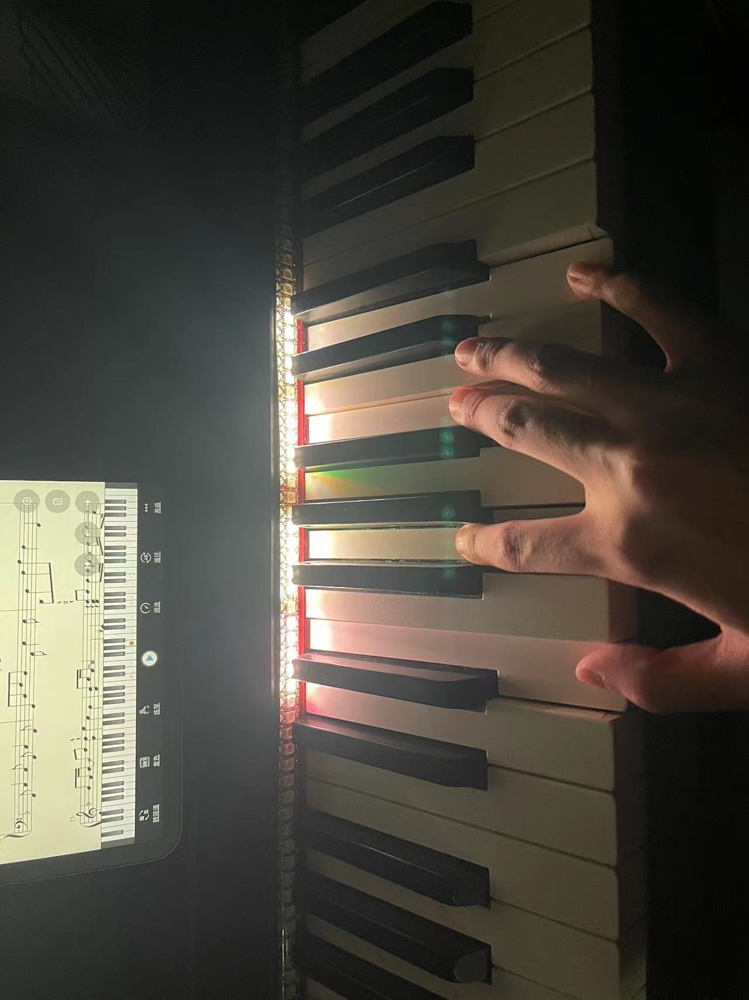

# 基于esp32的钢琴灯带

## 简介

基于esp32、ble通信协议实现的电钢琴装饰灯带，具有力度感应，可调节色调配置等。

## 硬件准备

- 被[FastLed](https://github.com/FastLED/FastLED)所支持的灯带

- 杜邦线若干

- esp32一块

## 软件准备

- arduino ide

### 为 arduino ide 添加 esp32 软件包

1. 在 [arduino-esp32](https://github.com/espressif/arduino-esp32/releases) 包发布页面复制最新的`package_esp32_index.json`地址

2. 在arduino ide中添加源，在board manager中安装esp32即可。

- BLE-MIDI 依赖

## 已知问题 

- esp32开发过程中 led 引脚需使用18号引脚，其他引脚会有隐式问题